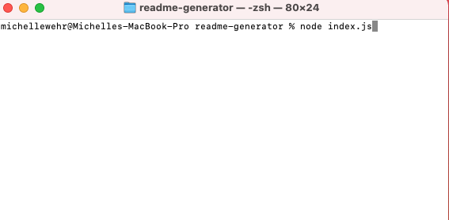
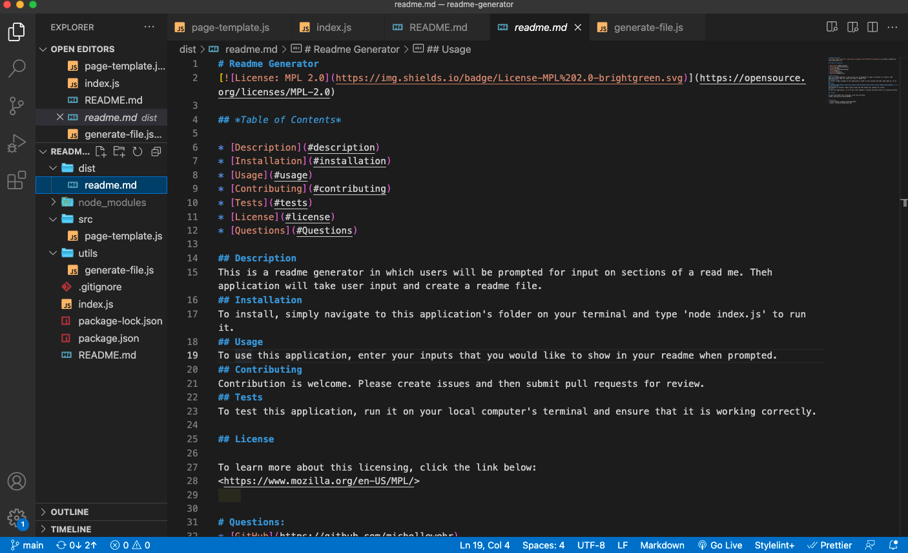

# README Generator

## Description

- Users are prompted with questions pertaining to sections of a readme, such as title, description, table of contents, installation, usage, license, contributing, tests, and questions. When a user enters their input, their input is taken and used to create a readme file. In the table of contents on the created readme file, a user can click on the name and be directed to that section of the readme.

[Walkthrough Video](https://drive.google.com/file/d/1dv-twMkRGK9D6MH7xfQ6fAnRxObLu6MG/view?usp=sharing)

## Installation

Clone the repository to your local computer and navigate to the repo in your terminal. Simply run 'node index' from the root of the directory to run the application.

## Usage

The purpose of this application is for users to be able to easily create a readme file for their project. Users will be prompted with questions that they will answer all in their command line. Their input will be returned into a formatted professional readme.

The following image is an example reade that was created with this application.

## Built with:

- Node.js

## This application can be found:

- [Repository](https://github.com/michellewehr/readme-generator)
- As a reminder, clone the repository to your local computer, navigate to the repository in your terminal and run 'node index.js' to initialize the application.

## Contribution

Anyone is welcome to contribute to this project. To do so, clone the local repository to your local workspace, create a git feature branch and request a pull request. Upon review, the pull request will then be accepted or denied.

## Sources

- Starter code was provided by Xandromus. The repo can be found: [here](https://github.com/coding-boot-camp/potential-enigma).

## Author

Michelle Wehr
